# Music Energy Analyzer

Visualises the **energy arc** of songs over time — showing how a track builds from its intro, peaks at the chorus, and winds down at the outro. Given a YouTube playlist, the notebook downloads audio as MP3, extracts three acoustic features per frame (RMS energy, spectral centroid, onset strength), blends them into a weighted stress score, smooths it with a rolling average, and produces three families of charts: per-song 3-panel breakdowns, a full-playlist overlay, and a top-3-vs-bottom-3 intensity ranking. The pipeline is deterministic, requires no AI models, and caches feature arrays to disk so re-runs are instant.

**Main technologies:** Python · Jupyter Notebook · yt-dlp · librosa · soundfile · NumPy · SciPy · matplotlib

**Monthly cost:** $0. This project uses no cloud services, no APIs, and no paid libraries. All processing runs locally on your machine. The only costs are electricity and internet bandwidth for the initial YouTube downloads.

---

## Table of Contents

1. [What It Produces](#what-it-produces)
2. [Stress Score](#stress-score)
3. [Data Processing Pipeline](#data-processing-pipeline)
4. [Function-Level Data Flow](#function-level-data-flow)
5. [Scoring Model](#scoring-model)
6. [Libraries](#libraries)
7. [Setup](#setup)
8. [Usage](#usage)
9. [Default Playlist](#default-playlist)

---

## What it produces

**Per-song chart (3 panels)**

| Panel | What you see |
|---|---|
| Top | Stress score — raw (per frame ≈ 23 ms) and smoothed (5 s window) |
| Middle | Feature breakdown: RMS energy, spectral centroid, onset strength |
| Bottom | Mel spectrogram (full frequency picture over time) |

**Batch overlay** — all songs' smoothed stress curves on one plot, useful for comparing energy arcs across tracks.

**Top 3 vs Bottom 3** — the three most intense and three calmest songs ranked by average stress score, plotted side by side.

---

## Stress score

The stress score is a weighted blend of three normalized features:

| Feature | Weight | What it captures |
|---|---|---|
| RMS energy | 50 % | Loudness / power |
| Spectral centroid | 25 % | Brightness (more treble = higher) |
| Onset strength | 25 % | Rhythmic density (attacks per second) |

---

## Data processing pipeline

The notebook follows seven sequential stages for each audio file.

### 1. Configuration

```python
PLAYLIST_URL = '...'   # any YouTube playlist
N_SONGS      = 40      # how many tracks to grab
SR           = 22050   # sample rate in Hz
HOP_LENGTH   = 512     # frame step ≈ 23 ms at SR=22050
SMOOTH_SEC   = 5       # rolling-window size for the macro stress curve
```

The playlist ID is extracted from the URL with a regex and used as the download folder name, so switching playlists never overwrites earlier downloads.

### 2. Download — `yt-dlp`

`yt-dlp` fetches the first `N_SONGS` entries from the playlist, extracts the best-quality audio stream via FFmpeg, and converts it to **192 kbps MP3**.

- Files are saved as `downloads/<playlist-id>/NN_<title>.mp3`.
- A `.yt-dlp-archive` file records every downloaded video ID; re-running the cell skips already-present tracks.

### 3. Audio loading — `librosa.load`

```python
y, sr = librosa.load(path, sr=SR, mono=True)
```

The MP3 is decoded and resampled to 22 050 Hz, converted to a single mono channel, and returned as a float32 NumPy array `y`. Every subsequent computation works on this waveform.

### 4. Feature extraction — `compute_features()`

The waveform is processed in overlapping **frames** of 512 samples (~23 ms each). Three scalar values are computed per frame:

| Feature | librosa call | What it measures |
|---|---|---|
| **RMS energy** | `librosa.feature.rms` | Root-mean-square amplitude of the frame — a direct proxy for loudness. |
| **Spectral centroid** | `librosa.feature.spectral_centroid` | Weighted average frequency of the spectrum — high values mean bright, treble-heavy sound; low values mean warm or bass-heavy sound. |
| **Onset strength** | `librosa.onset.onset_strength` | Rate of change of the spectrum between frames — spikes when new notes or beats start, capturing rhythmic density. |

A **times** array (one timestamp per frame) is also created with `librosa.times_like`.

Results are persisted to a `.features.npz` file alongside the MP3. On re-runs the cache is loaded directly, skipping the computationally expensive audio analysis.

### 5. Normalization and stress score

Each feature is independently scaled to **[0, 1]** with min-max normalization:

```python
def norm01(x):
    return (x - x.min()) / (x.max() - x.min() + 1e-8)
```

The three normalized signals are then blended into a single **per-frame stress score**:

```python
stress_raw = 0.50 * norm01(rms) + 0.25 * norm01(centroid) + 0.25 * norm01(onset_env)
```

### 6. Smoothing

The raw stress curve reacts to every drum hit and micro-transient. `scipy.ndimage.uniform_filter1d` applies a **uniform (box) rolling average** over a window of `SMOOTH_SEC × SR / HOP_LENGTH` frames, producing a smooth macro arc that reveals song-level structure (intro, verse, chorus, outro).

```python
smooth_frames = int(SMOOTH_SEC * SR / HOP_LENGTH)   # e.g. 215 frames for 5 s
stress_smooth = uniform_filter1d(stress_raw, size=smooth_frames)
stress_smooth = norm01(stress_smooth)                # re-normalize after smoothing
```

### 7. Visualization

Three output charts are produced:

**Per-song chart** (`<title>_stress.png`)
- Panel 1 overlays the raw stress (thin blue) and smoothed stress (thick red) time series.
- Panel 2 shows the three normalized features as semi-transparent lines for direct comparison.
- Panel 3 renders a **mel spectrogram** — the full time-frequency energy map computed with `librosa.feature.melspectrogram` and converted to dB with `librosa.power_to_db`.

**Batch overlay** (`all_songs_stress.png`)  
All smoothed stress curves drawn on a single axis with `tab10` colors for quick inter-song comparison.

**Top 3 vs Bottom 3** (`top3_vs_bottom3_stress.png`)  
Songs are ranked by the arithmetic mean of their smoothed stress curve. The three highest-average (warm colors) and three lowest-average (cool colors) tracks are plotted on separate sub-axes.

---

## Function-level data flow

The diagram below traces each Python function call, its inputs, its outputs, and how data moves through the notebook from raw URL to final PNG files.

```mermaid
flowchart TD
    subgraph INPUT["Inputs"]
        URL["PLAYLIST_URL\n(YouTube URL string)"]
        CFG["SR=22050 · HOP_LENGTH=512\nSMOOTH_SEC=5 · N_SONGS=40"]
    end

    URL -->|"re.search(r'[?&]list=([^&]+)')"| PID["playlist_id string"]
    PID --> DIR["DOWNLOAD_DIR\nPath('downloads/&lt;playlist-id&gt;')"]
    DIR & CFG --> STEP1

    subgraph STEP1["Step 1 — Download  (yt-dlp)"]
        D1["yt_dlp.YoutubeDL(ydl_opts)\n▸ format: bestaudio\n▸ FFmpegExtractAudio → MP3 192 kbps\n▸ playlistend: N_SONGS\n▸ download_archive: .yt-dlp-archive"]
        MP3[("NN_title.mp3 files\n.yt-dlp-archive (skip list)")]
        D1 --> MP3
    end

    MP3 --> STEP2

    subgraph STEP2["Step 2 — Load  (librosa / soundfile)"]
        L1["librosa.load(path, sr=22050, mono=True)"]
        L2["↳ soundfile reads MP3 bytes\n↳ resample to 22 050 Hz\n↳ downmix to mono float32"]
        Y["y : float32 array  [N_samples]\n~22 000 samples / sec"]
        L1 --> L2 --> Y
    end

    Y --> STEP3

    subgraph STEP3["Step 3 — compute_features(fpath, sr, hop_length)"]
        CHK{"cache .features.npz\nexists?"}
        HIT["np.load(cache)\n→ rms, centroid, onset_env, times"]
        RMS["librosa.feature.rms(y, hop_length=512)\n→ rms [F frames]"]
        CEN["librosa.feature.spectral_centroid(y, sr, hop=512)\n→ centroid [F frames]"]
        ONS["librosa.onset.onset_strength(y, sr, hop=512)\n→ onset_env [F frames]"]
        TIM["librosa.times_like(rms, sr=22050, hop=512)\n→ times [F frames]"]
        SAVE["np.savez(cache, rms, centroid, onset_env, times)"]
        CHK -->|"yes"| HIT
        CHK -->|"no"| RMS & CEN & ONS & TIM --> SAVE
    end

    HIT & SAVE --> FEATS["rms[F] · centroid[F] · onset_env[F] · times[F]\nF ≈ duration_s × 22050 / 512  (e.g. 12 127 frames for a 4.7 min song)"]

    FEATS --> STEP4

    subgraph STEP4["Step 4 — Normalize & Score"]
        N1["norm01(x) = (x − min) / (max − min + 1e-8)\napplied independently to rms, centroid, onset_env"]
        N2["stress_raw =\n  0.50 × norm01(rms)\n+ 0.25 × norm01(centroid)\n+ 0.25 × norm01(onset_env)"]
        N1 --> N2
    end

    N2 --> STEP5

    subgraph STEP5["Step 5 — Smooth  (scipy)"]
        S1["smooth_frames = int(SMOOTH_SEC × SR / HOP_LENGTH)\ne.g. 215 frames for SMOOTH_SEC=5"]
        S2["uniform_filter1d(stress_raw, size=smooth_frames)\n→ stress_smooth  (box rolling average)"]
        S3["norm01(stress_smooth)  ← re-normalize to [0, 1]"]
        S1 --> S2 --> S3
    end

    S3 --> BRANCH((" "))
    Y --> BRANCH

    BRANCH --> PER_SONG & BATCH_OVL & RANKING

    subgraph PER_SONG["Per-Song Chart  (matplotlib · librosa.display)"]
        PS1["Panel 1: ax.plot(times, stress_raw, color=steelblue)\n         ax.plot(times, stress_smooth, color=crimson)\nfmt_time(x, _) formats x-axis as mm:ss"]
        PS2["Panel 2: ax.plot(times, norm01(rms), color=orange)\n         ax.plot(times, norm01(centroid), color=green)\n         ax.plot(times, norm01(onset_env), color=purple)"]
        PS3["librosa.feature.melspectrogram(y, n_mels=128, hop=512)\nlibrosa.power_to_db(S, ref=np.max)\nlibrosa.display.specshow(S_dB, x_axis='time', y_axis='mel', cmap='magma')"]
        PS4["plt.savefig('&lt;title&gt;_stress.png', dpi=150)"]
        PS1 --> PS2 --> PS3 --> PS4
    end

    subgraph BATCH_OVL["Batch Overlay  (matplotlib)"]
        BO1["for fpath in audio_files:\n  compute_features(fpath) → norm01 → uniform_filter1d"]
        BO2["ax.plot(times, stress_smooth)\ntab10 palette, one color per song"]
        BO3["plt.savefig('all_songs_stress.png', dpi=150)"]
        BO1 --> BO2 --> BO3
    end

    subgraph RANKING["Top 3 vs Bottom 3  (matplotlib)"]
        RK1["stress_means[fpath] = float(stress_smooth.mean())\nfor every song in playlist"]
        RK2["ranked = sorted(stress_means, key=stress_means.get, reverse=True)\ntop3 = ranked[:3]  ·  bottom3 = ranked[-3:]"]
        RK3["2-panel figure: warm colors (red/orange/yellow) for top3\ncool colors (blue/green/purple) for bottom3\nplt.savefig('top3_vs_bottom3_stress.png', dpi=150)"]
        RK1 --> RK2 --> RK3
    end

    PS4  --> OUT1[("&lt;title&gt;_stress.png")]
    BO3  --> OUT2[("all_songs_stress.png")]
    RK3  --> OUT3[("top3_vs_bottom3_stress.png")]
```



---

## Scoring model

### What kind of model is this?

This project does **not** use any machine-learning or trained model. The stress score is a **handcrafted linear scoring function** — a deterministic formula that maps three acoustic measurements to a single perceptual value without any training data or optimization loop.

```
stress_raw[t] = 0.50 × norm(RMS[t]) + 0.25 × norm(centroid[t]) + 0.25 × norm(onset_env[t])
```

### Why this approach was chosen

| Criterion | Rationale |
|---|---|
| **No labeled data needed** | There is no universally agreed ground-truth for how "stressed" or "intense" a song sounds — it is subjective. A supervised model would require a large, carefully labeled dataset that does not exist in a standard form. |
| **Interpretability** | Each weight has a clear musical meaning. Analysts can immediately understand why a passage scores high or low. |
| **Determinism** | The same audio always produces the same score. There are no random seeds, no model drift, no inference uncertainty. |
| **Speed** | After feature extraction (the only expensive step), scoring is a handful of vectorized NumPy operations running in milliseconds. |

### Why these specific weights?

The 50 / 25 / 25 split is grounded in psychoacoustic research:

- **RMS energy (50 %)** — Perceived loudness is the dominant dimension of musical intensity. Studies in psychoacoustics consistently show that overall amplitude is the strongest predictor of how energetic a passage feels.
- **Spectral centroid (25 %)** — Brightness (the balance of treble vs. bass) is a secondary but significant contributor to perceived tension. Bright, treble-heavy passages (distorted guitars, cymbals, sharp synths) read as more intense than warm, bass-heavy ones.
- **Onset strength (25 %)** — Rhythmic density adds perceived energy independently of loudness. A rapid flurry of quiet notes can feel just as busy as a loud sustained chord. Equal weight to centroid reflects that both dimensions carry roughly the same perceptual load.

### Key parameters and their effect

| Parameter | Default | Effect of increasing | Effect of decreasing |
|---|---|---|---|
| `SR` | 22 050 Hz | Higher frequency resolution, larger arrays, slower | Fewer samples, faster but misses high-frequency detail |
| `HOP_LENGTH` | 512 samples (~23 ms) | Fewer frames, coarser time resolution | More frames, finer time resolution, slower |
| `SMOOTH_SEC` | 5 s | Macro arc, hides verse/chorus boundaries | Fine arc, reacts to individual phrases |
| `ε` in `norm01` | 1e-8 | (safety constant, avoid division by zero on silent tracks) | — |
| Weight vector | [0.50, 0.25, 0.25] | Shifting weight to centroid → brightness-driven score | Shifting weight to onset → rhythm-driven score |

### Normalization choice

Min-max normalization was chosen over z-score (standardization) because it maps each feature to an absolute **[0, 1]** range regardless of units (Hz, dB-RMS, arbitrary onset units). This makes the weighted sum meaningful — all three features contribute on the same scale. The trade-off is that a single outlier frame (e.g., a very loud transient) can compress the rest of the curve toward 0; the `1e-8` epsilon prevents a complete division-by-zero on silent recordings.

### Mel spectrogram (not a model — a perceptual transform)

The bottom panel of each chart uses a **mel filterbank** to map the linear frequency axis to the mel scale — a nonlinear frequency scale that approximates how the human auditory system perceives pitch. The 128 mel bands are computed with `librosa.feature.melspectrogram`, then converted to decibels with `librosa.power_to_db`. This is a classical signal processing transform (not a learned model), chosen because it makes the spectrogram visually interpretable: equal vertical spacing corresponds to equal perceived pitch differences.

---

## Libraries

> **Note on AI technologies:** This project is a classical **digital signal processing (DSP)** pipeline. None of the libraries below involve generative AI (GenAI), large language models (LLMs), speech-to-text conversion, image diffusion models, image classification, chatbots, Retrieval-Augmented Generation (RAG), or agentic AI frameworks. The entire pipeline is algorithmic and deterministic.

### `yt-dlp`
**[yt-dlp](https://github.com/yt-dlp/yt-dlp)** — Robust YouTube / playlist downloader, forked from youtube-dl with active maintenance and broader site support. In this project it selects the best available audio stream, delegates format conversion to FFmpeg (`FFmpegExtractAudio` post-processor), and maintains a `.yt-dlp-archive` file that prevents redundant re-downloads across notebook runs.

### `librosa`
**[librosa](https://librosa.org/)** — The core audio analysis library and the heart of the feature extraction pipeline. Built on top of NumPy and SciPy, it provides:
- `librosa.load` — MP3/WAV decoding, resampling, and mono conversion (delegates to soundfile / audioread internally)
- `librosa.feature.rms` — Frame-level root-mean-square energy
- `librosa.feature.spectral_centroid` — Frequency-weighted centroid of the spectrum
- `librosa.onset.onset_strength` — Spectral flux-based onset detection envelope
- `librosa.feature.melspectrogram` — Mel-scaled power spectrogram using a triangular filterbank
- `librosa.power_to_db` — Converts power to decibel scale
- `librosa.display.specshow` — Renders spectrograms with correct frequency and time axes

### `soundfile`
**[soundfile](https://python-soundfile.readthedocs.io/)** — Low-level audio I/O backend used by librosa to read and write WAV, FLAC, and OGG files. It is based on libsndfile (a C library). Required even when loading MP3s because librosa's loading chain passes through it for format detection and decoding.

### `numpy`
**[numpy](https://numpy.org/)** — Foundation for all numerical computation in the pipeline. Every waveform, feature array, and spectrogram is a NumPy `ndarray`. Min-max normalization, the weighted stress blend, and array indexing are all vectorized NumPy operations, running orders of magnitude faster than Python loops.

### `scipy`
**[scipy](https://scipy.org/)** — Scientific computing library built on NumPy. The project uses `scipy.ndimage.uniform_filter1d`, a fast 1-D **uniform (box) filter** that applies a rolling average with equal weights across a sliding window. This is the smoothing step that converts the noisy per-frame stress signal into a readable macro arc.

### `matplotlib`
**[matplotlib](https://matplotlib.org/)** — The visualization engine for all three chart types. Specific features used:
- `plt.subplots` with `gridspec_kw` for panels of different heights
- `ax.fill_between` for semi-transparent area fills under stress curves
- `ticker.FuncFormatter` with a custom `fmt_time` function to display the x-axis as `mm:ss`
- `plt.get_cmap('tab10')` for the 10-color batch palette
- `fig.colorbar` for the dB scale on the mel spectrogram panel

### `pathlib`
**[pathlib](https://docs.python.org/3/library/pathlib.html)** — Standard-library module for object-oriented file-system paths. Used throughout to construct download directories, feature cache paths (`.features.npz`), and output PNG paths in a cross-platform, string-concatenation-free way.

### `re`
**[re](https://docs.python.org/3/library/re.html)** — Standard-library regex module. Extracts the playlist ID from the URL with a single pattern (`[?&]list=([^&]+)`) so the download folder name changes automatically when the playlist URL changes.

---

## Setup

```bash
git clone https://github.com/fborbon/music-analytics.git
cd music-analytics
pip install yt-dlp librosa soundfile
```

Jupyter and the scientific stack (`numpy`, `scipy`, `matplotlib`) are assumed to be installed. If not:

```bash
pip install jupyterlab numpy scipy matplotlib
```

---

## Usage

Open the notebook and run cells top to bottom:

```bash
jupyter lab music_stress_analysis.ipynb
```

1. **Install** — installs missing dependencies into the kernel
2. **Config** — set `PLAYLIST_URL`, `N_SONGS`, and `SMOOTH_SEC`
3. **Download** — fetches audio as MP3 into `downloads/<playlist-id>/`; re-running skips already-downloaded tracks
4. **Analysis** — set `FILE_IDX` to pick a song, then run feature extraction and plot cells
5. **Batch** — overlays all songs' stress curves in one chart
6. **Top / Bottom 3** — ranks every song by average stress and compares the extremes

> The notebook uses a `.yt-dlp-archive` file and `.features.npz` caches so re-runs skip completed steps automatically.

---

## Default playlist

The notebook is pre-configured with the [YouTube Audio Library — Free Public Domain Music](https://www.youtube.com/playlist?list=PLh5X0e7-mnI3lh-nb3fwZ8OcndGLfVdZX) playlist (334 tracks, CC0 / public domain). Swap `PLAYLIST_URL` for any other playlist.

---

## Auditing

This section provides a structured checklist for review by an IT expert and an audio / music-information-retrieval subject-matter expert.

### Audit Items

- **Cost & resource minimization** — The project incurs $0 in costs. All processing is local; no cloud services, paid APIs, or licensed software are used. Bandwidth is the only cost, limited to initial YouTube downloads.
- **IT architecture** — Seven well-defined sequential pipeline stages with `.npz` feature caching per song. The playlist-ID-derived download folder prevents cross-playlist cache collisions. Clean for a Jupyter notebook use case.
- **Code efficiency** — Min-max normalization (`norm01`) is sensitive to outlier frames: a single very loud transient can compress the entire rest of the curve toward zero. The `1e-8` epsilon prevents division-by-zero on silent tracks but does not address the outlier problem. The box rolling average (`uniform_filter1d`) is the fastest choice for uniform smoothing.
- **Cybersecurity** — No credentials or API keys required. No external data transmission beyond YouTube audio downloads. The `.yt-dlp-archive` file prevents redundant re-downloads.
- **Readability & maintainability** — The 50/25/25 weight rationale is documented with psychoacoustic justification. The `SMOOTH_SEC` parameter's effect on macro arc vs. phrase-level detail is clearly explained. Configuration is centralized in one notebook cell.
- **Scoring model adequacy** — The hand-crafted linear scoring function is a deliberate, well-justified design choice (no labeled training data exists for subjective "stress"). It is interpretable, deterministic, and fast. Its main limitation is that the weights are fixed and may not generalize across all musical genres (e.g., electronic music where loudness is heavily compressed).
- **Legal** — The default playlist uses CC0 / public-domain audio. Users should verify the license of any custom playlist before redistribution of outputs. yt-dlp usage is subject to YouTube's Terms of Service.
- **Other** — No automatic cleanup mechanism for downloaded MP3 files, which can accumulate significant disk space for large playlists. `N_SONGS` is the only resource bound.

### Summary Table

| Audit Item | Claude's Assessment | Human Expert Assessment |
|---|---|---|
| Cost & resource minimization | $0/month. Bandwidth for initial downloads is the only cost. No cloud or API dependency. | |
| IT architecture | Clean sequential pipeline with per-song caching. Appropriate architecture for a notebook-based analysis tool. | |
| Code efficiency | Min-max normalization vulnerable to outlier transients. Box filter is the right choice for uniform smoothing. | |
| Cybersecurity | No credentials. No external transmission beyond YouTube downloads. No user data collected. | |
| Readability & maintainability | Weight rationale and parameter effects are well-documented. Centralized configuration. | |
| Scoring model adequacy | Intentionally hand-crafted (no training data). Interpretable and deterministic. May not generalize to heavily compressed genres. | |
| Legal | Default playlist is CC0. Users must verify licenses for custom playlists. yt-dlp subject to YouTube ToS. | |
| Other | No disk-space cleanup mechanism for accumulated MP3s. N_SONGS is the only download bound. | |
